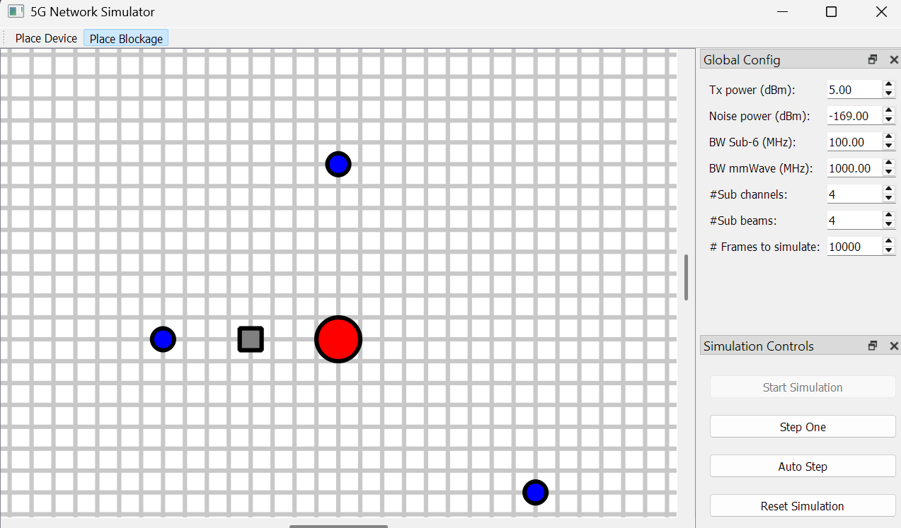

# Project II

Sinh viên: Huỳnh Đoàn Minh Đức
MSSV: 20225179
Giảng viên hướng dẫn: TS. Đinh Thị Hà Ly

# Cài đặt
Chuẩn bị môi trường Python 3
```
git clone https://github.com/DucHDM-225179/ProjectII.git
cd ProjectII
python -m pip install -r requirements.txt
python simulation.py
```

# Về phần mềm mô phỏng

Sử dụng chuột phải và kéo thả để di chuyển màn hình
Sử dụng cuộn chuột để phóng to / thu nhỏ
Sử dụng chuột trái để đặt, có thể chọn giữa đặt thiết bị / vật cản
Điều chỉnh tham số qua bảng config
Bấm "Start Simulation" để tiến hành mô phỏng
Có thể chọn "Step One" để bước 1 bước mô phỏng, hoặc "Auto Step" để tự động chạy đến hết
Nếu muốn thay đổi, hoặc chạy lại, bấm Reset Simulation để reset mô phỏng về bước đầu tiên